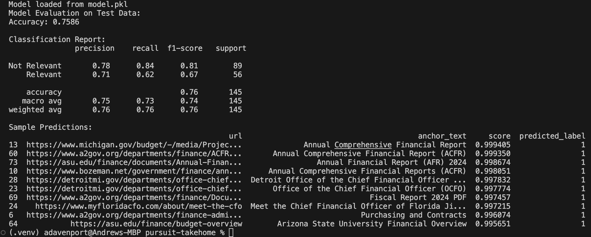
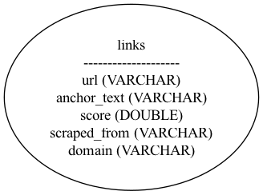
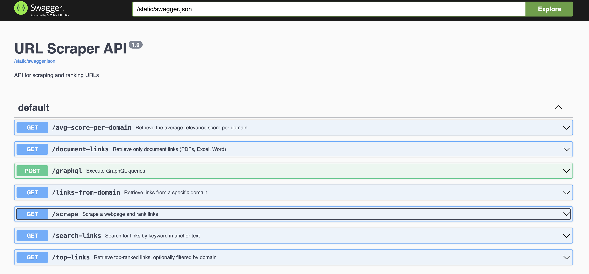

# High-Value Link Scraper with API

## Overview
A Flask-based web scraper that extracts, ranks, and prioritizes high-value links from web pages using Playwright for scraping, a simple ML model for ranking, DuckDB for storage, and a REST/GraphQL API for easy access.

## Installation
To run the flask app locally, first install all packages from requirements.txt into either your global Python environment, or
preferably a virtual environment for testing. 
### Install locally
```
git clone https://github.com/adavenport94/pursuit-th.git
cd pursuit-th
<activate preferred python virtual env>
pip install -r requirements.txt
```

### Link prioritization approach
The URL Ranker prioritizes the most relevant links using a mix of machine learning, text analysis, and custom scoring rules

#### Training the Model
The ranking model is a Logistic Regression classifier trained on different features pulled from URLs and anchor text. The training process includes:
- TF-IDF Vectorization – Converts URL text into numerical features based on word importance.
- Fuzzy Matching – Checks how closely the text matches high-priority keywords (e.g., finance-related terms) and boosts relevant links.
- Word Embeddings (GloVe) – Uses pre-trained word vectors to compare how closely a link's text relates to useful terms.
- URL Depth Scoring – Gives higher priority to deeper URLs with positive keywords(e.g., example.com/reports/finance/ACFR_2024 is more valuable than example.com/reports/finance).
- Negative + Positive Keyword Filtering – Lowers scores for links with words like "advertisement" or "request" and increases scores for words like "finance".
- Once the model is trained, it’s saved as a .pkl file and used for scoring new links.

##### Why Logistic Regression?
It was easy to train and gives a clear probability score for ranking URLs as high or low value. Since it works well with TF-IDF, fuzzy matching, and embeddings, it handled text features without much tuning.

#### How New URLs Get Ranked
Whenever the scraper pulls new links, the ranking model scores them based on:
- Cleaning & Normalizing URLs – Strips unnecessary characters and extracts useful text features.
- TF-IDF & Fuzzy Matching – Measures how important certain words are and compares them to priority keywords.
- Word Embeddings Similarity – Uses GloVe word vectors to determine if a link is semantically relevant.
- URL Depth Scoring – Deeper URLs are weighted more heavily because they’re more likely to have useful content.
- Final Score Calculation – Combines all of these factors and runs them through the Logistic Regression model, which outputs a relevance score.

#### Second-Level Scraping
If a link has a high score, the scraper follows it and extracts more links from that page. We could extend this to recursively call as well.
- The model runs again on these new links
- This makes sure only the best URLs are explored further

#### How It Could Be Improved
The ranking system has an accuracy of about 75% using a treshold of .90. It could be improved by
- Training on more diverse dataset to improve accuracy.
- Using more advanced models
- Fine-tune priority keyword weights to better differentiate high and low-value links.
- Add metadata features like page content length for smarter scoring.



#### Alternative appraoch
I initially thought about using OpenAI’s GPT, but that wouldn't have been much fun :D. That said, it would have been a pretty straightforward solution:
- Send the URL and anchor text to OpenAI’s API.
- Have GPT to evaluate the relevance based on criteria.
- Return a score or ranking explanation.
- Use this score to prioritize links for further scraping.

## ML Model
### Training the model
The model is trained using a predefined dataset within `train_model.py`, generating the `model.pkl file`. To initiate the training process, simply run:
```
python train_model.py
```

### Testing the model
Evaluate the model’s accuracy and view output examples by running the following command:
```
python test_model.py
```

## Web Scraper
Went with Playwright for scraping since it’s fast, headless, and works across Chromium, Firefox, and WebKit. And it handles JavaScript, so it can grab content from pages that load dynamically. Some sites didn’t play nice with Chrome, so having Firefox as a fallback was nice.
### How could we scale?
To make this scraper more powerful, we could:
- Dockerize it, package it up for easy deployment, even trigger it with a Lambda.
- Use Celery + Redis to process in parallel.
- Set up cron jobs to automate scraping on a schedule so it runs hands-free.

### Testing the scraper
Run a quick script to fetch scraped URLs from a given webpage. Modify the URL in the script to experiment with different sites.
```
python playground.py
```

## Data Structuring & Storage
Went with DuckDB because it's lightweight, fast, and similar to ClickHouse since it's columnar. That said, I didn’t really take advantage of the columnar benefits like selecting only the columns I need or partitioning data. Also played around with GraphQL since I didn’t have much experience with it before.
### How could we scale?
- Use Parquet instead of tables so we’re not loading everything into memory.
- Partition the data by domain, date, or score so DuckDB only scans what’s needed instead of the whole table.
- Leverage indexing and compression since DuckDB is optimized for that.
- Move old data to S3 so we don’t have to keep everything locally but can still query it when needed.
- Run queries in parallel by taking advantage of multi-threading support.

### Super simple schema


## API for Accessing Scraped Data
Using Flask API as the main interface for interacting with the scraper, database, and ML model. Has RESTful endpoints for scraping, retrieving, and searching links.
Includes GraphQL support, though SQL queries handle most of the structured data retrieval.
### Async support!
After building most of this with Flask, I realized its synchronous nature could be a bottleneck if we wanted to scale. A better option would’ve been FastAPI, since it handles async requests much better.

## Running the Service
Starts the Flask API, initializes a DuckDB instance, and loads the ML model.
```
python app.py
```

## Config file
Holds various settings for UrlRanker, including PRIORITY_KEY_WORDS and NON_PRIORITY_KEY_WORDS, which the model uses to boost or downgrade rankings based on relevance. 

## Using the Service
Routes and example payloads can be viewed within the Swagger UI being served at the following location: 



```
http://127.0.0.1:5000/swagger/#/default
```

### Routes
Scrape a webpage and rank URLs:
```
http://127.0.0.1:5000/scrape?url=https://boerneisd.net

Example response:
{
  "message": "Scraped 538 links from https://boerneisd.net (including second-level scrapes)",
  "ranked_links": [
    {
      "anchor_text": "Annual Financial Reports",
      "domain": "boerneisd.net",
      "score": 0.9993700837181825,
      "scraped_from": "https://boerneisd.net",
      "url": "https://boerneisd.net/departments/business-and-financial-services/financial-transparency/annual-financial-reports"
    },
    {
      "anchor_text": "Adopted Budgets",
      "domain": "boerneisd.net",
      "score": 0.9971968051404828,
      "scraped_from": "https://boerneisd.net",
      "url": "https://boerneisd.net/departments/business-and-financial-services/financial-transparency/adopted-budgets"
    },
    {
      "anchor_text": "RFCSP 24-004 Central Office & Academy Improvements",
      "domain": "boerneisd.net",
      "score": 0.9959381587048176,
      "scraped_from": "https://boerneisd.net/departments/business-and-financial-services/purchasing",
      "url": "https://www.boerneisd.net/cms/lib/TX50000022/Centricity/Domain/76/BISD24004-JH-102024.pdf"
    },
    ...
    ...
```

Fetch average score per domain:
```
http://127.0.0.1:5000/avg-score-per-domain

Example response:
{
  "avg_scores": [
    {
      "avg_score": 0.12162112316637565,
      "domain": "www.a2gov.org"
    }
  ],
  ...
  ...

```

Fetch document links:
```
http://127.0.0.1:5000/document-links

Example response:
{
  "document_links": [
    {
      "anchor_text": "Poverty Exemptions",
      "domain": "www.a2gov.org",
      "score": 0.007099975987308933,
      "scraped_from": "https://www.a2gov.org/finance-and-administrative-services/purchasing/bid-process",
      "url": "https://www.a2gov.org/media/d01lrej1/2025-poverty-exemption-application.pdf"
    }
  ],
  ...
  ...
}
```

Fetch links by domain:
```
http://127.0.0.1:5000/links-from-domain?domain=www.a2gov.org

Example response:
{
  "links_from_domain": [
    {
      "anchor_text": "City Bids & Contracts",
      "domain": "www.a2gov.org",
      "score": 0.9286739873575741,
      "scraped_from": "https://www.a2gov.org",
      "url": "https://www.a2gov.org/finance-and-administrative-services/purchasing/bid-process"
    },
    {
      "anchor_text": "Nextdoor",
      "domain": "www.a2gov.org",
      "score": 0.5741645419302701,
      "scraped_from": "https://www.a2gov.org",
      "url": "https://nextdoor.com/agency-detail/mi/ann-arbor/city-of-ann-arbor-1"
    },
    ...
    ...
```

GraphQL:
```
http://127.0.0.1:5000/graphql

Example payloads:
{
  "query": "{ topLinks(limit: 30) { url anchorText score } }"
}

{
  "query": "{ linksFromDomain(domain: \"www.a2gov.org\") { url anchorText score scrapedFrom } }"
}

{
  "query": "{ documentLinks { url anchorText score scrapedFrom } }"
}

{
  "query": "{ searchLinks(keyword: \"Bids\") { url anchorText score scrapedFrom } }"
}

{
  "query": "{ avgScorePerDomain { domain avgScore } }"
}
```

## Built With
- Python 3.12.9
- Flask 3.1.0
- flask-swagger-ui 4.11.1
- Flask-GraphQL 2.0.1
- graphene 2.1.9
- pandas 2.2.3
- duckdb 1.2.0
- playwright 1.50.0
- scikit-learn 1.6.1
- gensim 4.3.3
- numpy 1.26.4
- fuzzywuzzy 0.18.0
- black 25.1.0


